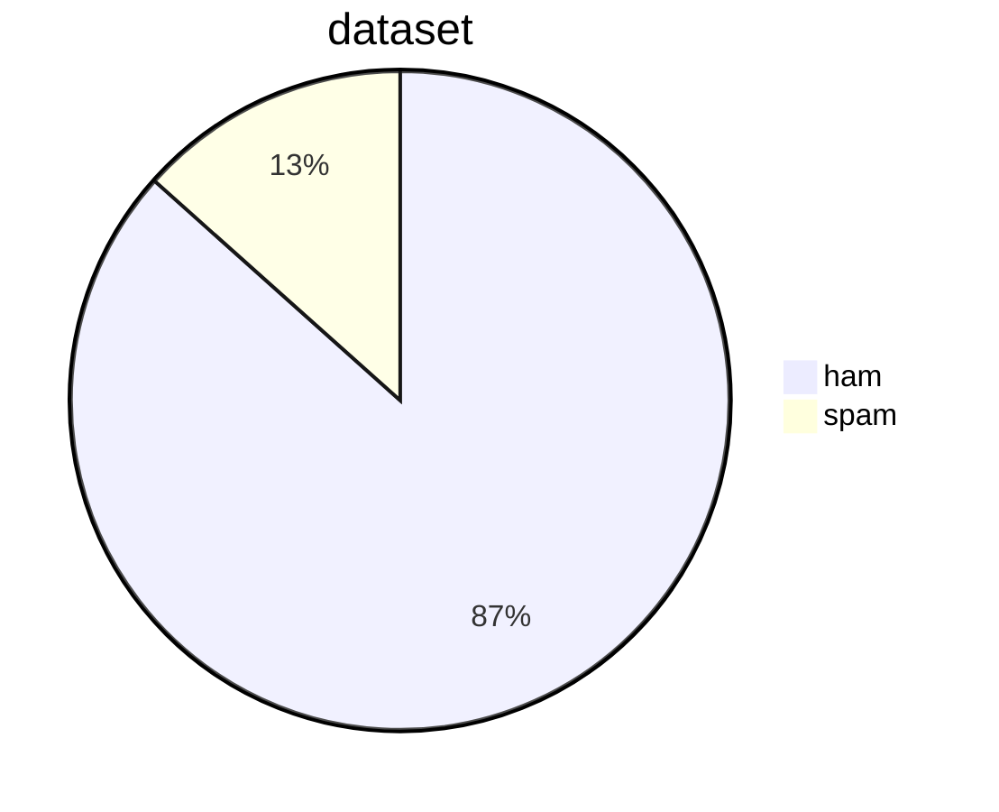
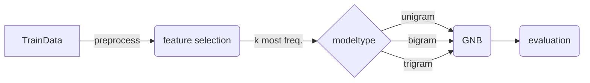
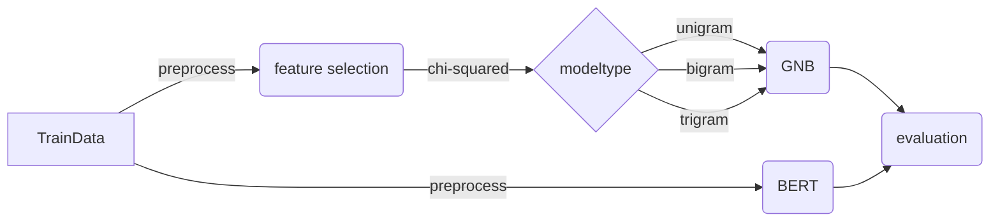

# NYCU-2023Spring-Introduction_to_AI-final_project
## Ham or Spam email type prediction.
### Introduction
Spam emails in your inbox would be annoying since it disturbs the routine. That is why our email accounts already have got a spam filter. In addition, it would be interesting to know about how it is developed and different ways of filtering methods so as to filter spam emails more efficiently and effectively.  
In this project,we want to discuss performance between different language models like ngram and BERT. We will also discuss how to improve the most fundamental ngram models.
### Related work
#### 1. sentiment analysis
Sentiment analysis (or opinion mining) is a natural language processing (NLP) technique used to determine whether data is positive, negative or neutral. Sentiment analysis is often performed on textual data to help businesses monitor brand and product sentiment in customer feedback, and understand customer needs.    
#### 2. mail type predictor  
Most emails nowadays are generated using a fixed template by machines,such messages include shopping receipts, promotional campaigns, newsletters, booking confirmations, etc. With this convenient technique,it's even more easy for someone to send spam(trash) emails with bad intention.  
In this project,we want to simulate the mail type classifier to predict the mail is ham(good) or spam(bad).  
The difference b/t our project and most existing ones is that we don't use the state of the art models like XGBoost,we compare the difference b/t the most fundamental language model ngram,ngram w/different feature selection method called chi suqare,and a advanced technique called BERT.  

### Dataset/Platform
I am using Spambase dataset from [here](https://www.kaggle.com/datasets/nittalasatyasrinivas/smsspamcollectiontsv) and split them into 2 manually for training and testing.  
The distribution of dataset is presented below.  


### Baseline
In the baseline,we use Gaussian Naive Bayes classifier w/ unigram,bigram,trigram and k-th highest freq. as feature selection method 

#### unigram
The appearance prob. of a word is independent from the other words.
```
P(W1,W2,W3,...,Wn) = P(W1)* P(W2)*P(W3) *…*P(Wn-1)*P(Wn)
```
#### bigram
The appearance prob. of a word is relevant to that of previous word.
```
P(W1,W2,W3,...,Wn) = P(W1)* P(W2|W1)*P(W3|W2) *…*P(Wn|Wn-1)
```
#### trigram
The appearance prob. of a word is relevant to that of two previous word.
```
P(W1,W2,W3,...,Wn) = P(W1)* P(W2|W1)*P(W3|W2,W1) *…*P(Wn|Wn-1,Wn-2)
```
#### Feature selection
Feature selection is the process of selecting what we think is worthwhile in our documents, and what can be ignored.  
We select the k most 'worthwhile' data as feature and use them to fit Gaussian Naive Bayes classifier.  
In the baseline model,we use the most intuitive way : choose k-th highest freq. uni/bi/trigrams as our feature.  

### Main approach

#### 1.Chi-squared test for feature selection  
Based on ngram model,instead of choosing k-th highest freq. uni/bi/trigrams,we change to another feature selection method called  Chi-Squared test for feature selection.
Chi-squared test is a statistical method that can calculate the degree of how dependent a featue is to the final answer.  
The equation is given in below,where “O” stands for observed or actual value and “E” stands for expected value of that feature. 
  
Eexpected values are calculated using the equation below.<br/><br/>
<br/><br/>
After calculating the chi-squared value of each feature,we select the k(default=500) highest and use them to fit Gaussian Naive Bayes classifier.
#### 2.Bert
BERT is a transformer-based model that utilizes a deep neural network architecture known as the transformer. It is trained in an unsupervised manner on a large corpus of text, using a technique called "masked language modeling." During training, a portion of the input text is randomly masked, and the model is trained to predict the masked words based on the surrounding context.

One of the key innovations of BERT is its ability to capture the bidirectional context of words. Unlike previous language models that only considered the left or right context of a word, BERT considers both sides, allowing it to better understand the meaning of a word in relation to its surrounding words.<br/><br/>
The pre-training process of BERT involves two main tasks: masked language modeling (MLM) and next sentence prediction (NSP). MLM involves randomly masking words in the input text and training the model to predict the masked words. NSP involves providing pairs of sentences to the model and training it to predict whether the second sentence follows the first in the original text.

However,in pursuit of speed,we use DistilBERT in this project. DistilBERT is a transformers model, smaller and faster than BERT, which was pretrained on the same corpus in a self-supervised fashion, using the BERT base model as a teacher. This means it was pretrained on the raw texts only, with no humans labelling them in any way  (which is why it can use lots of publicly available data) with an automatic process to generate inputs and labels from those texts using the BERT base model.  
<br/>After pre-training, BERT can be fine-tuned on specific downstream NLP tasks such as text classification,which is what we use here : mail type prediction.

### Evaluation metric
We define four parameters as follows  
True Positive (TP) : when predicted ham email is actually ham email   
True Negative (TN) : when predicted ham email news is actually spam email  
False Negative (FN) : when predicted spam email is actually spam email  
False Positive (FP) : when predicted spam email is actually ham email  <br/>    
Then we can furthur define four evaluation metrics based on above 4 parameters.
```
Recall = TP/(TP + FN) 
```
Recall is a metric that records the ratio of the correctly positively-labeled by our program to all ham emails in reality.
```
Precision = TP/(TP + FP)
```
Precision is a metric that measures how precise the prediction is if we predict the label to be positive(ham).
We can view precision as follows : 
How many of those who we labeled as ham are actually ham?

```
F1-score = 2 * Precision * Recall / (Precision + Recall)
```
F1 Score is a metric that considers both precision and recall,and equalizes the importance of both parameters.
It is the harmonic mean(average) of the precision and recall.

### Result 
F1 socre of 3 ngram models under different feature selection methods.


Precision of 3 ngram models under different feature selection methods.


Recall of 3 ngram models under different feature selection methods.


### Analysis & Discussion
#### 1. Chi-squared test for feature selection
We can see that in both unigram and bigram models,there's a significant improvement in all of the 3 evaluation metrics. In contrast to the trigram model,which already has a better prerformance because its better connectivity of context,the improvement of chi-square test is thus not that obvious.
<br/>After printing 20 highest ranked features the 2 methods select,we can find that what sorting method choose is like ( 'of','the' ),( 'and','the' ),( 'to','be' )...etc,which are obviously not related to content of real text.However,in the chi-squared feature selection mehod,the features it select are like ('await','collect'),('tri', 'contact'), ('1000', 'cash'),which are more close to the content of real text compared to sorting method.

#### 2.BERT
With the result shown above,we can see the strong power of BERT using its pre-trained model.The improvement can be obviously seen in Recall and F1-score,which means that the ratio of the correctly positively-labeled increases.The reason behind this I think is that BERT introduces a mechanism called 'self-attention',which automatically detects which words are related to the final answer.Besides,it considers the semantic of the whole sentence,and that's exactly the drwaback of negram model,beacuse it only considers the relationship in nearby words. 

### Limitation 
#### 1.Chi-suqared feature selection
Although it has a relatively better performance compared with sort feature selection method,the most fundamental issue limiting the performance of the model is ngram model,which only considers considers the relationship in nearby words,instead of the semantic of whole sentence.

#### 2.BERT
The limitation of model based on BERT in this project should be the size of data set. If we can get more labeled ham/spam data,the 3 evaluation metrics should be more close to real world situation.However,in this project,the amount of data set is already able to show the differnet perfomace b/t baseline and main approaches.

### Practical use
One possible way is to use the models mentioned above to predict the mails in my own email inbox. To get the dataset,just extract emails from Gmail from 'Inbox' and 'Spam' folders and label them manually.Next,train the model using the methods metioned above and then we can predict the test data set which is the upcoming emails and see their result.According to the reslut,put them in the 'Inbox' or 'Spam'.